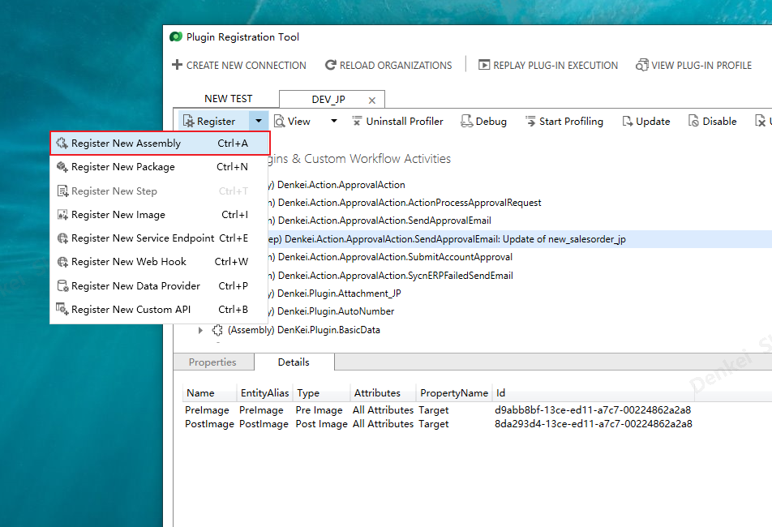
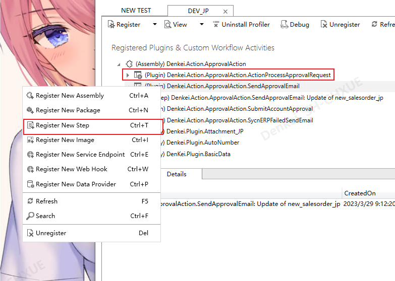
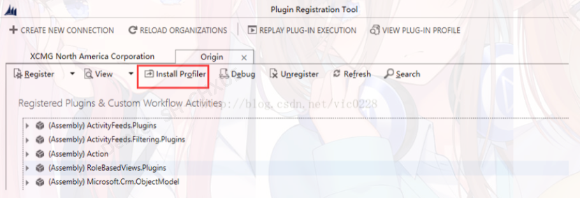
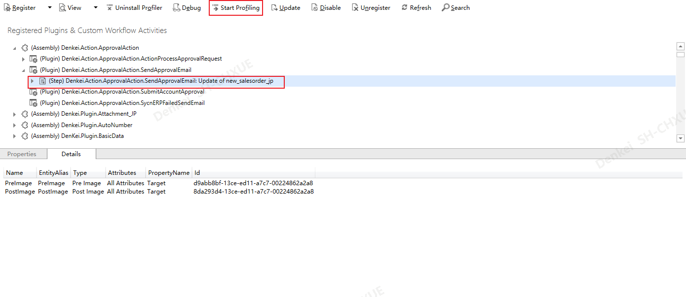
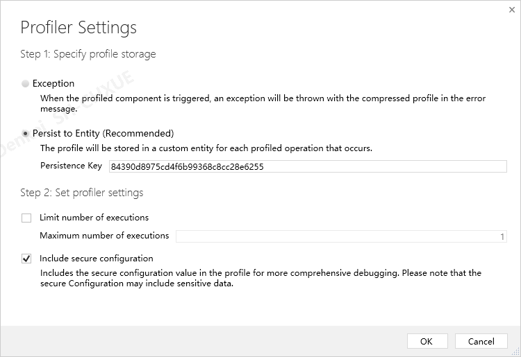
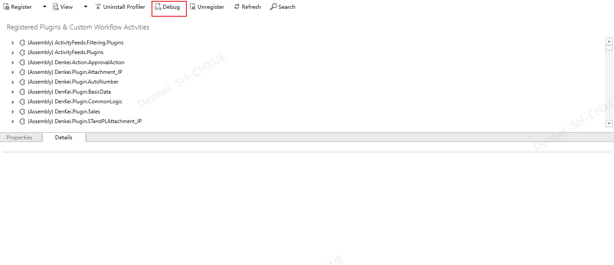
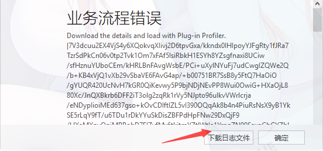
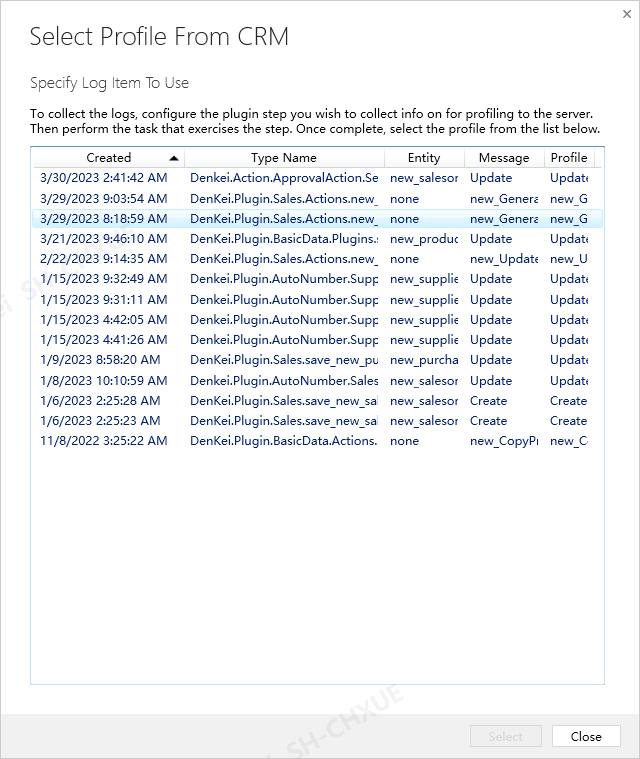
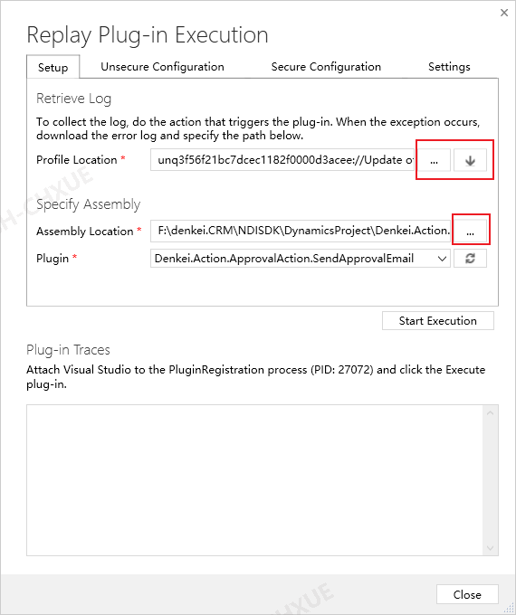
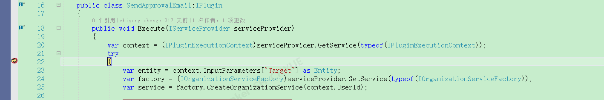

# 使用

## 注册

注册程序集

创建新步骤

## 调试

安装调试工具

选择要调试的插件，如**step**，点击**Start Profiling**

运行CRM程序，选择下载日志文件，或者不下载

选择日志文件及生成的dll文件

设置断点，点击调试=>附加PluginRegistration进程

点击**Start Execution**

自动到断点

