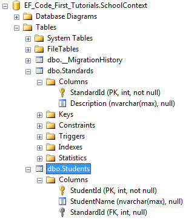
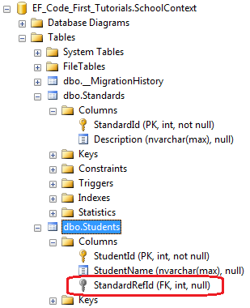

# EF Core注意事项

## 生成语句

```
Add-Migration
Update-Database

Scaffold-DbContext "Server=127.0.0.1;port=3306;Database=database;User ID=root;Password=123456;Charset=utf8;SslMode=None" MySql.EntityFrameworkCore -OutputDir test(文件夹) -f
```

## 注解

## 外键（ForeignKey）

```c#
public class Student
{
    public int StudentID { get; set; }
    public string StudentName { get; set; }
    //Foreign key for Standard
    public int StandardId { get; set; }
    public Standard Standard { get; set; }
}

public class Standard
{
    public int StandardId { get; set; }
    public string StandardName { get; set; }
    public ICollection<Student> Students { get; set; }
}
```

上面的代码例子中，描述了Student和Standard实体中的一对多关系。为了解释一对多关系，Student类包含了一个StandardId属性还有一个引用类型的属性Standard，并且Standard实体包含了一个集合类型的导航属性Students,Student实体中的StandardId属性匹配上了Standard实体中的主键属性名称StandardId，所以Student实体中的StandardId属性将会自动变成外键属性，并在数据表中生成外键




```C#
using System.ComponentModel.DataAnnotations.Schema;

public class Student
{
    public int StudentID { get; set; }
    public string StudentName { get; set; }
    [ForeignKey("Standard")]
    public int StandardRefId { get; set; }
    public Standard Standard { get; set; }
}

public class Standard
{
    public int StandardId { get; set; }
    public string StandardName { get; set; }
    public ICollection<Student> Students { get; set; }
}
```

ForeignKey特性应用于StandardRefId属性上，并且传入导航属性的名称Standard到name参数上，这样就会在Students表中创建一个外键列StandardRefId，这样就不会生成默认的StandardID列了


