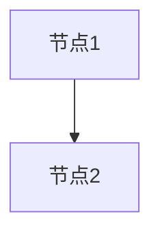
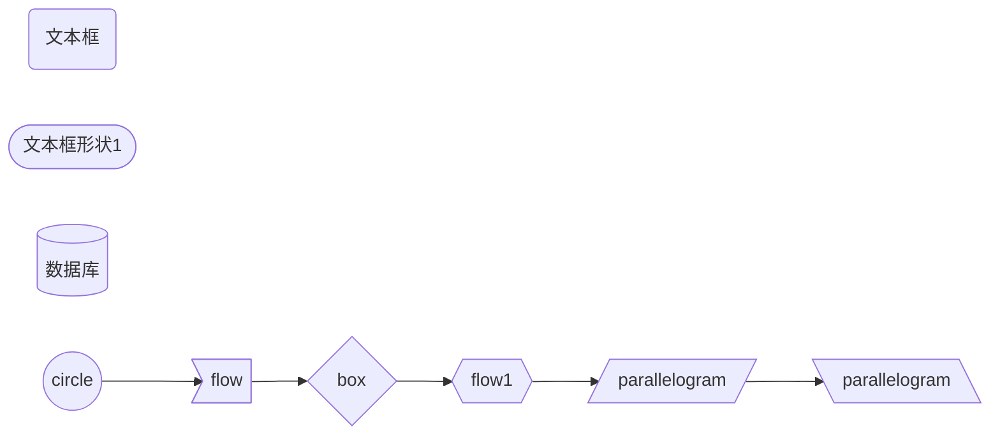
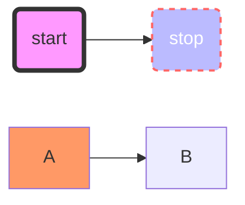
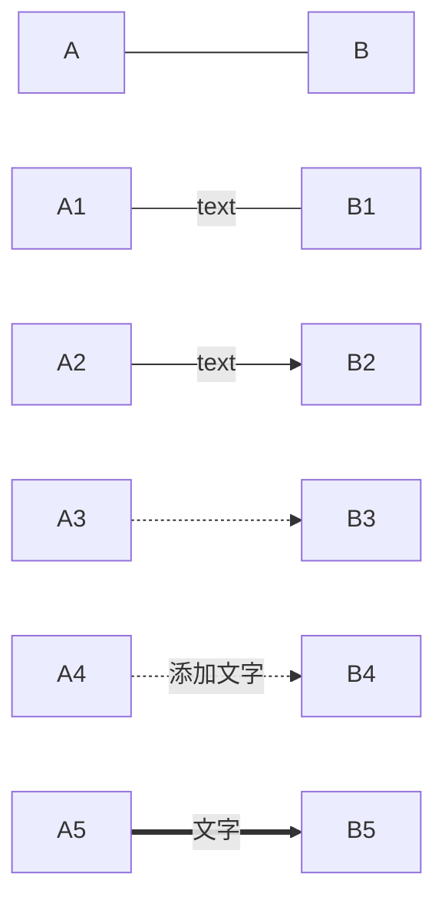
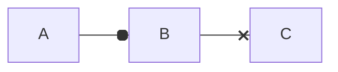
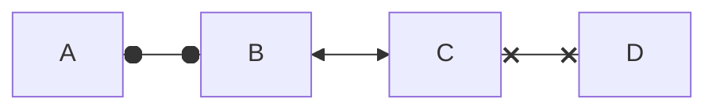
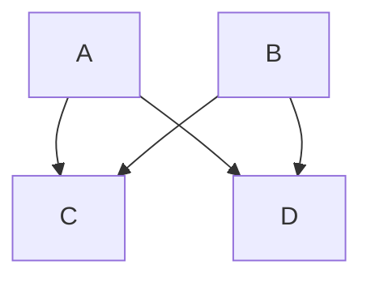
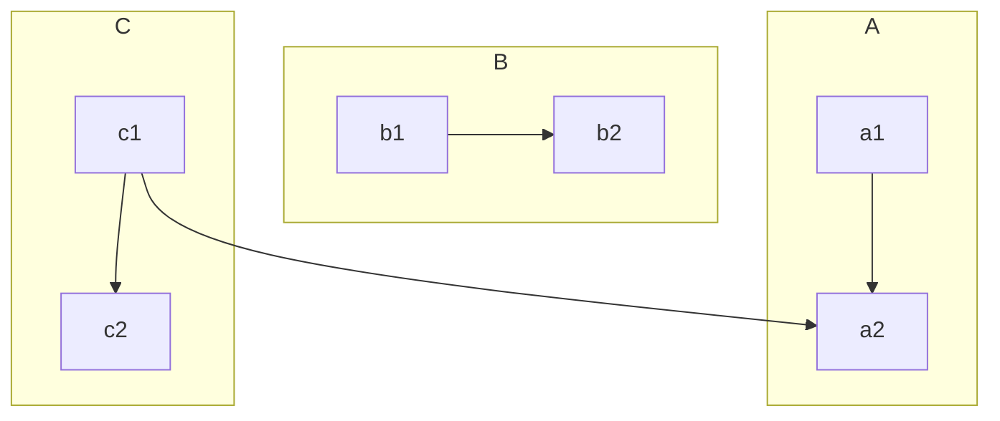
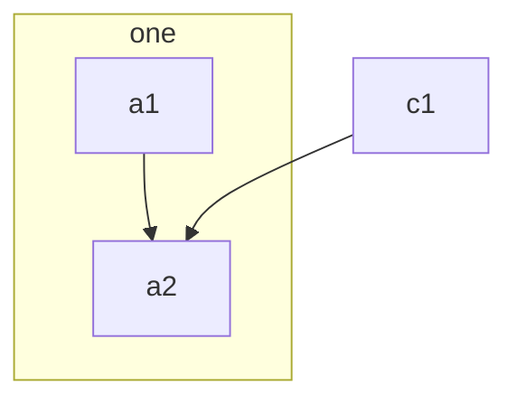
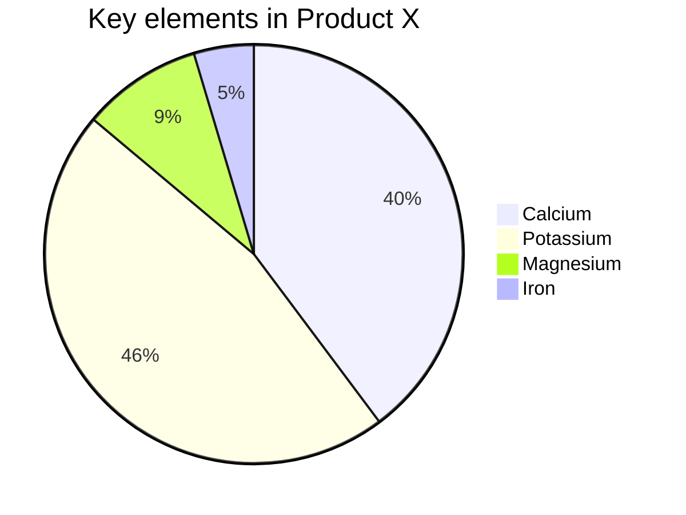

| 代码 | 含义                 |
| ---- | -------------------- |
| TB   | top to bottom 上到下 |
| BT   | bottom to top 下到上 |
| RL   | right to left 右到左 |
| LR   | left to right 左到右 |
| TD   | top to down 上到下   |





















```flow
st=>start: 开始框
 
op=>operation: 处理框
 
cond=>condition: 判断框(是或否?)
 
sub1=>subroutine: 子流程
 
io=>inputoutput: 输入输出框
 
e=>end: 结束框
 
st->op->cond
 
cond(yes)->io->e
 
cond(no)->sub1(right)->op
```

```flow
st=>start: 开始框
 
op=>operation: 处理框
 
cond=>condition: 判断框(是或否?)
 
sub1=>subroutine: 子流程
 
io=>inputoutput: 输入输出框
 
e=>end: 结束框
 
st(right)->op(right)->cond
 
cond(yes)->io(bottom)->e
 
cond(no)->sub1(right)->op
```



