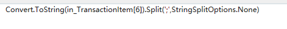
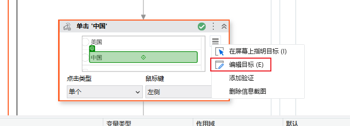
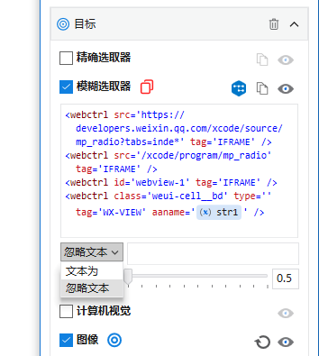
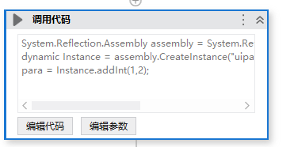
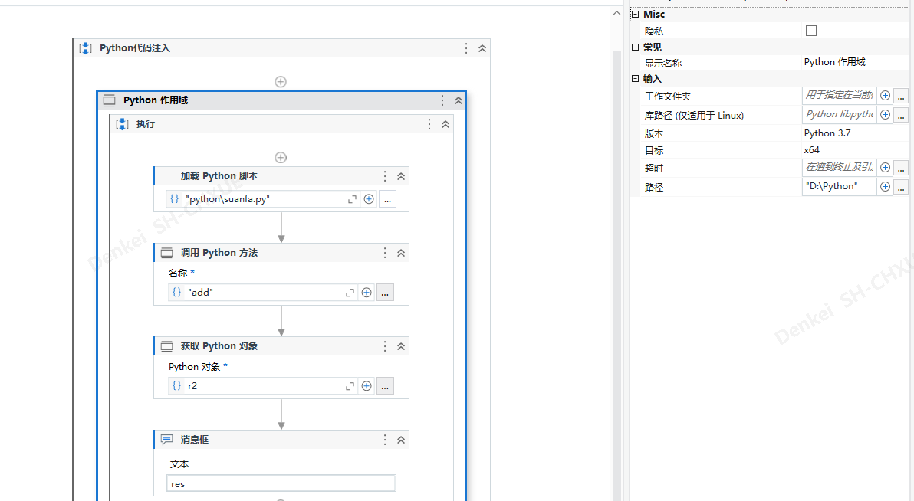
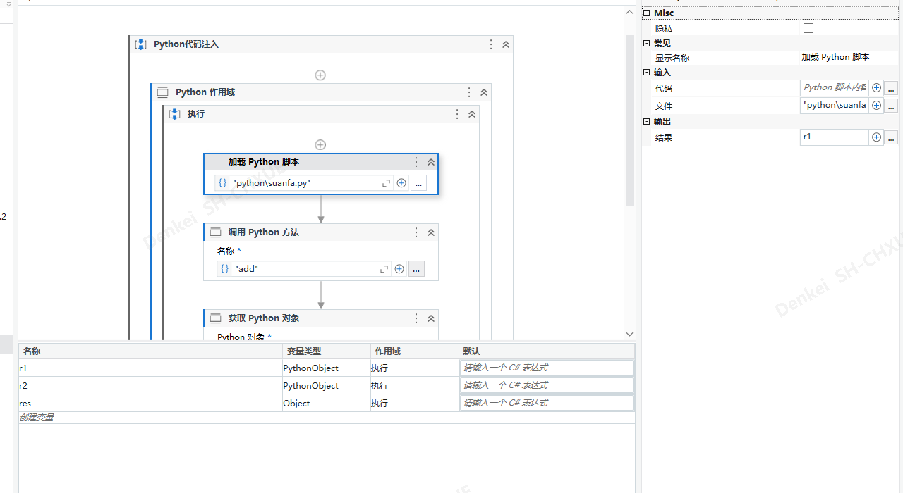
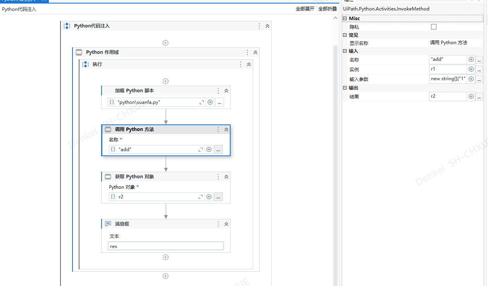
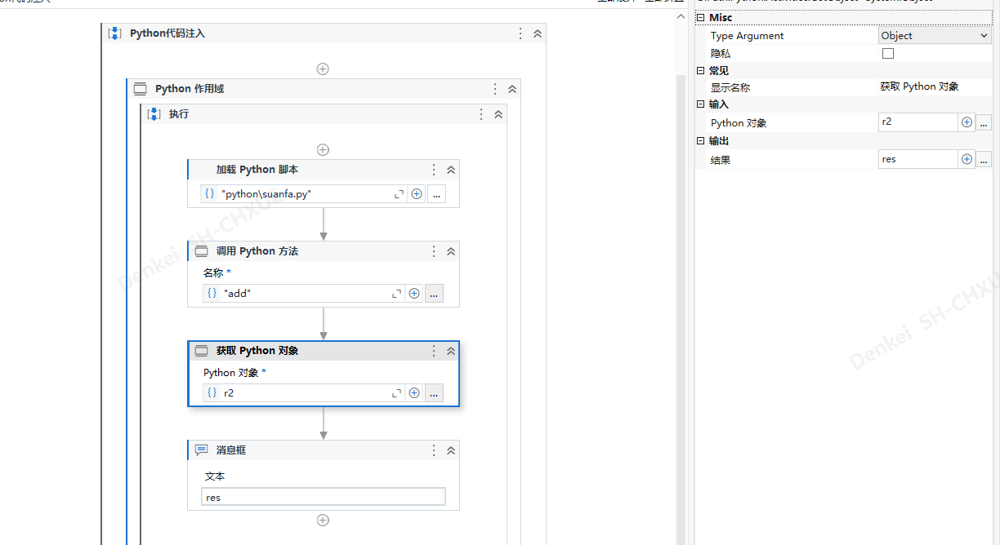
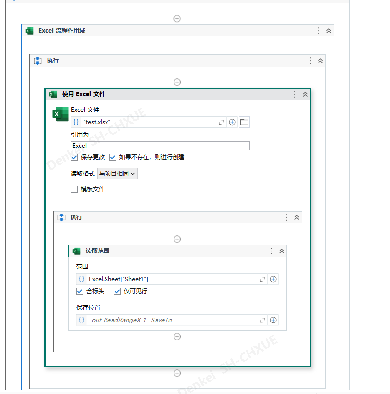
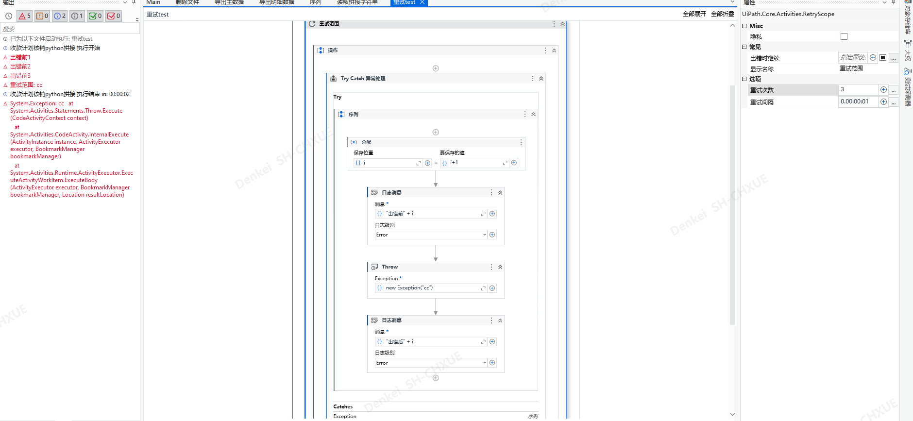

# UiPath

## 使用注意事项

使用Split需要加上StringSplitOptions.None



鼠标放到“aaname”右键单击

使用单击控件：选择“文本为”，必须在后面输入值，aaname后可以输入值，选择“忽略文本”，aaname后必须输入值







## 调用c#程序集

使用“调用代码”



```c#
System.Reflection.Assembly assembly = System.Reflection.Assembly.LoadFrom(@"uipathtest.dll");
dynamic Instance = assembly.CreateInstance("uipathtest.AddNumber");//命名空间.类名
para = Instance.addInt(1,2);//addInt方法

//C#代码，不能使用static
namespace uipathtest
{
    public class AddNumber
    {
        public int addInt(int a, int b)
        {
            return a + b;
        }
        public int addInt(int a)
        {
            return a;
        }
        public int addInt(int a, int b,int c)
        {
            return a + b + c;
        }
    }
}
```


## 调用python脚本

电脑需要安装python环境（版本不能太高）

[电脑需要安装一个插件]: https://download.visualstudio.microsoft.com/download/pr/3aa4e942-42cd-4bf5-afe7-fc23bd9c69c5/64da54c8864e473c19a7d3de15790418/windowsdesktop-runtime-5.0.17-win-x64.exe

uipath需要下载python依赖（UiPath.Python.Activities）







这里的输入参数只能使用string[]类型





## Excel

读取范围的传值方式



## 重试范围

重试次数包括首次运行的次数；

会运行出错之前的模块；


