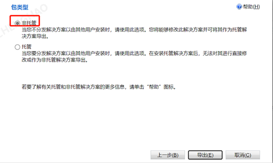

# Dynamics 365

##  导出窗体

**选择“添加现有”，选择“实体”**

**选择解决方案，点击“导出”**

**点击“下一步”**

**点击下一步**

**不选择，直接“下一步”**

**默认非托管，点击“导出”**

## 导出代码

**选择“添加现有”，选择“web资源”**

**选择解决方案，点击“导出”**

**点击“下一步”**

**点击下一步**

**不选择，直接“下一步”**

**默认非托管，点击“导出”**

## 导入解决方案

**点击“导入”**

**点击“选择文件”，选择导出的压缩文件，并点击“下一步”**

**点击“导入”**

**导入成功，发布**

