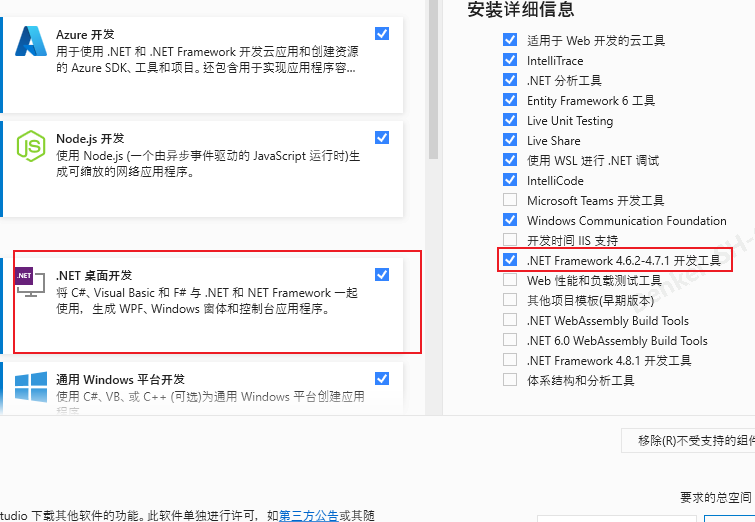

# PCF控件

## 创建

```text
pac pcf init --namespace 命名空间 --name 控件名 --template field
pac pcf init --namespace PCFDateTime --name PCFDateTime --template field
```

在Visual Studio Code中打开解决方案

```text
Code .
```

安装组件

```text
npm install 或
yarn install
```

编写代码

```text
　　......
```

解决方案

```text
npm run build 或
yarn build
```

预览和调试解决方案

```text
npm start
npm start watch
yarn start
yarn start watch
```

创建打包目录

```text
mkdir Solutions
cd Solutions
```

初始化Dataverse 解决方案

```text
pac solution init --publisher-name 发布者(DefaultPublisherorgde161028) --publisher-prefix 发布者前缀(new)
pac solution init --publisher-name DefaultPublisherorgde161028 --publisher-prefix new
```


添加组件到解决方案

```text
控件绝对路径
pac solution add-reference --path F:\Apps\test\ImageUploadControl\
在Solutions目录下的相对路径
pac solution add-reference --path ../
```

第一种：生成/发布解决方案包(此方案报错)

```text
msbuild /t:build /restore
msbuild /p:configuration=Release
```


错误信息


报错需要添加




第二种：生成/发布解决方案包(修改可用的方案)

```
//生成发布非托管方案
dotnet msbuild /t:build /restore
//生成托管方案（推荐），保持发布者是命令行中定义的
dotnet msbuild /p:configuration=Release
```

第三种：生成/发布解决方案包

```text
dotnet build
```

返回到主目录

```text
cd ..
```

连接CDS

```text
pac auth create --url (环境URL)
pac auth create --url https://orgde161028.crm.dynamics.cn/
```


推送解决方案

```text
pac pcf push --publisher-prefix 发布者前缀
pac pcf push --publisher-prefix new
```


## 更新

```text
yarn build  或  npm build
cd Solutions
dotnet build
cd ..
pac pcf push --publisher-prefix new
```


## 安装 PCF CLI

```
npm install -g powerapps-cli
pac --version
npm update -g powerapps-cli

```

## pac

```
pac help
  admin                       使用您的 Power Platform 管理员帐户
  application                 用于列出和安装 AppSource 中的可用 Dataverse 应用程序的命令
  auth                        管理各种服务的身份验证方式
  canvas                      处理 Power Apps .msapp 文件
  connector                   (预览版)用于处理 Power Platform 连接器的命令
  data                        导入和导出 Dataverse 中的数据。
  help                        显示有关 Microsoft Power Platform CLI 的帮助
  org                         与您的 Dataverse 组织合作
  package                     用于处理 Dataverse 包项目的命令
  paportal                    使用 Power Apps 门户网站的命令
  pcf                         用于处理 Power Apps component framework 项目的命令
  plugin                      用于处理 Dataverse 插件类库的命令
  solution                    用于处理 Dataverse 解决方案项目的命令
  telemetry                   管理遥测设置
  tool                        可以安装和启动的 Power Platform Tools
```


## ControlManifest.Input.xml 注解

```
<?xml version="1.0" encoding="utf-8" ?>
<!-- namespace: 代码组件的命名空间
Constructor: 代码组件的构造函数
Version: 组件的版本。每当更新组件时，都需要更新版本以查看运行时中的最新更改
display-name-key: 代码组件在UI上显示的名称
description-name-key: 代码组件在UI上显示的说明
control-type: 代码组件类型。仅支持标准类型的代码组件-->
<manifest>
  <control namespace="DenkeiApps" constructor="ImageUploadControl" version="1.0.1" display-name-key="ImageUploadControl" description-key="ImageUploadControl description" control-type="standard" >
    <!--external-service-usage 该节点声明此控件是否使用外部服务，如果使用，此控件将被视为高级控件，请添加外部域；如果没有使用任何外部服务，请设置enabled="false"，并且不要在下面添加任何域。enabled”默认为false。
    使用外部服务:
      <external-service-usage enabled="true">
        <domain>www.Microsoft.com</domain>
      </external-service-usage>
    不使用外部服务:
      <external-service-usage enabled="false">
      </external-service-usage>
    -->
    <external-service-usage enabled="false">
      

    </external-service-usage>
    <!-- 该节点标识控件可以从CDS获取特定的、可配置的数据块。of-type属性也可以是of-type-group属性，of-type属性包含TwoOptions，Enum，Multiple，SingleLine.Text，numbers。usage属性包含bound、input，output。input输入，output输出，bound绑定行为，如选择文件-->
    <property name="ImageUploadProperty" display-name-key="ImageUpload_Display_Key" description-key="ImageUpload_Description" of-type="Multiple" usage="bound" required="true" />
    <!--
      <type-group name="numbers">
        <type>Whole.None</type>
        <type>Currency</type>
        <type>FP</type>
        <type>Decimal</type>
      </type-group>
      <property name="sampleProperty" display-name-key="Property_Display_Key" description-key="Property_Desc_Key" of-type-group="numbers" usage="bound" required="true" />
    -->
    <!-- resources节点引入。包含构建代码组件的可视化和样式化的所有资源-->
    <resources>
      <code path="index.ts" order="1"/>
      
      <!--
      <css path="css/ImageUploadControl.css" order="1" />
      <resx path="strings/ImageUploadControl.1033.resx" version="1.0.0" />
      -->
    </resources>
    <!-- feature-usage元素充当元素的包装器，这些元素本身允许开发人员声明组件希望使用哪些特性。如果没有定义uses-feature元素，则不需要feature-usage元素
    <feature-usage>
      <uses-feature name="Device.captureAudio" required="true" />
      <uses-feature name="Device.captureImage" required="true" />
      <uses-feature name="Device.captureVideo" required="true" />
      <uses-feature name="Device.getBarcodeValue" required="true" />
      <uses-feature name="Device.getCurrentPosition" required="true" />
      <uses-feature name="Device.pickFile" required="true" />
      <uses-feature name="Utility" required="true" />
      <uses-feature name="WebAPI" required="true" />
    </feature-usage>
    -->
    <feature-usage>
      <uses-feature name="Device.pickFile" required="true" />
    </feature-usage>

  </control>
</manifest>
```

