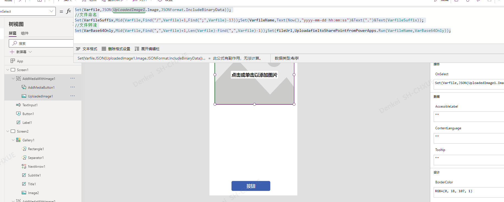
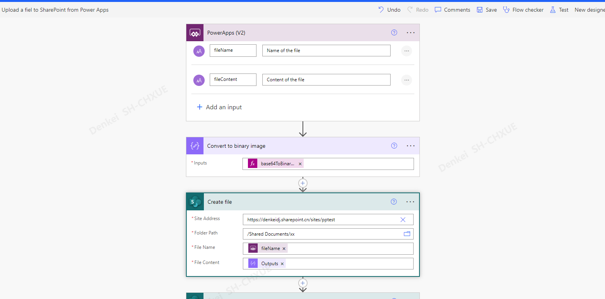

# 界面操作

## sftp

ListFolder如果是中文路径的话，需要将转换的+号替换为%2B

## 文件上传到SharePoint

Set(Varfile,JSON(*UploadedImage1*.Image,JSONFormat.IncludeBinaryData));

//文件命名

Set(VarfileSuffix,Mid(Varfile,Find("/",Varfile)+1,Find(";",Varfile)-13));Set(VarfileName,Text(Now(),"yyyy-mm-dd hh:mm:ss")&Text(".")&Text(VarfileSuffix));

//文件转流

Set(VarBase64Only,Mid(Varfile,Find(",",Varfile)+1,Len(Varfile)-Find(",",Varfile)-1));Set(fileUrl,UploadafieltoSharePointfromPowerApps.Run(VarfileName,VarBase64Only));

