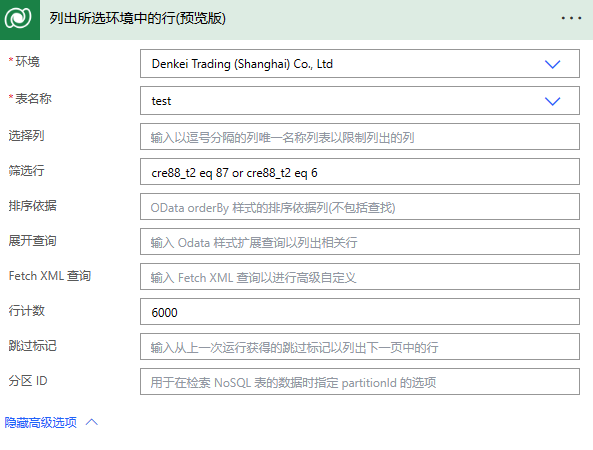

# Power Automate

## 筛选数据可使用的符号

```
1. 等于运算符（“eq”）：用于筛选等于特定值的行。例如：
Department eq 'Sales' 
 
2. 不等于运算符（“ne”）：用于排除不等于特定值的行。例如：
Department ne 'Human Resources' 
 
3. 大于运算符（“gt”）：用于筛选大于特定值的行。例如：
Sales gt 1000 
 
4. 小于运算符（“lt”）：用于筛选小于特定值的行。例如：
Quantity lt 10 
 
5. 大于等于运算符（“ge”）：用于筛选大于等于特定值的行。例如：
Price ge 50 
 
6. 小于等于运算符（“le”）：用于筛选小于等于特定值的行。例如：
Discount le 0.2 
 
7. 包含运算符（“contains”）：用于筛选包含特定文本的行。例如：
contains(ProductName, '手机') 
 
8. 不包含运算符（“not contains”）：用于排除包含特定文本的行。例如：
not contains(ProductName, '电视') 
 
9. 开头为运算符（“startswith”）：用于筛选以特定文本开头的行。例如：
startswith(CustomerName, 'A')  
 
10. 结尾为运算符（“endswith”）：用于筛选以特定文本结尾的行。例如：
endswith(CustomerName, 'Co') 
 
11. 包含于运算符（“in”）：用于筛选值在特定集合中的行。例如：
State in ('NY', 'CA', 'TX') 
 
12. 不包含于运算符（“not in”）：用于排除值在特定集合中的行。例如：
Category not in ('Clothing', 'Shoes') 
 
13. 逻辑与运算符（“and”）：用于同时满足多个条件的行。例如：
Department eq 'Sales' and Sales gt 1000 
 
14. 逻辑或运算符（“or”）：用于满足任意一个条件的行。例如：
Department eq 'Sales' or Department eq 'Marketing' 
 
```


