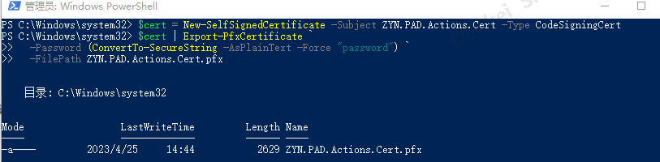
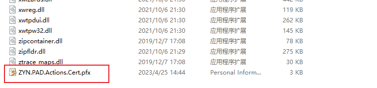
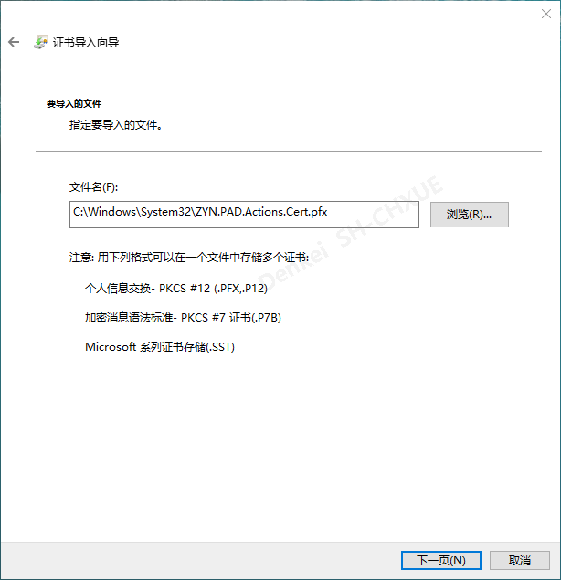
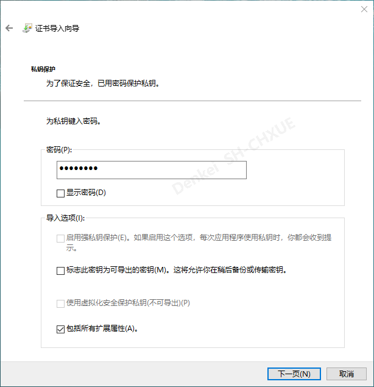
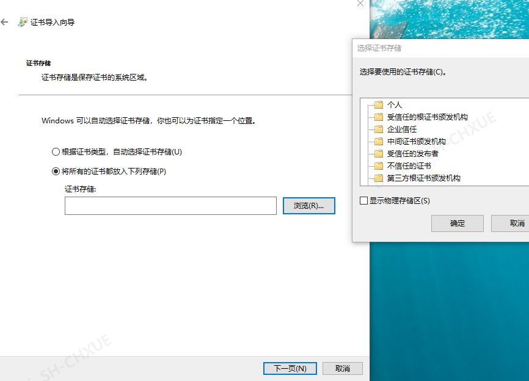
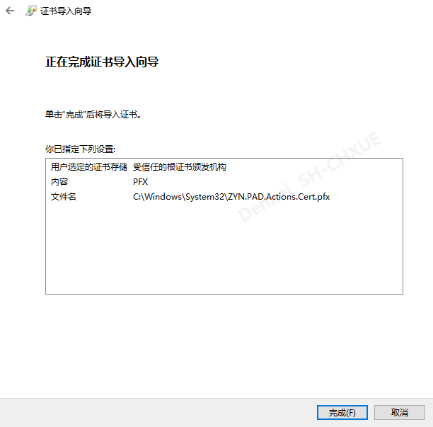
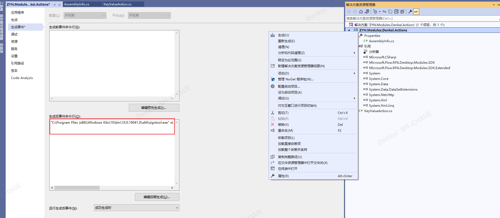
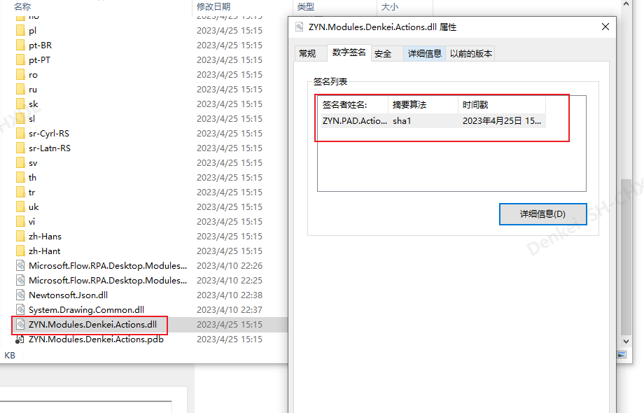

# Automate Desktop

## 组件开发

### 证书

ZYN.PAD.Actions.Cert是证书名 password是密码

```
$cert = New-SelfSignedCertificate -Subject ZYN.PAD.Actions.Cert -Type CodeSigningCert

$cert | Export-PfxCertificate `
  -Password (ConvertTo-SecureString -AsPlainText -Force "password") `
  -FilePath ZYN.PAD.Actions.Cert.pfx

```




把这个证书安装到本地电脑的信任根颁发机构中去。找到这个pfx文件，双击即可安装。



可以选择当前用户或者本地计算机，此案例是选择本地计算机




创建证书的密码



将证书安装到 `受信任的根证书颁发机构`




点击完成






证书路径部分，实际路径替换:C:/Windows/System32/ZYN.PAD.Actions.Cert.pfx

```
"C:\Program Files (x86)\Windows Kits\10\bin\10.0.19041.0\x64\signtool.exe" sign /tr http://timestamp.digicert.com /f C:/Windows/System32/ZYN.PAD.Actions.Cert.pfx /p password $(AssemblyName).dll
```

生成dll


